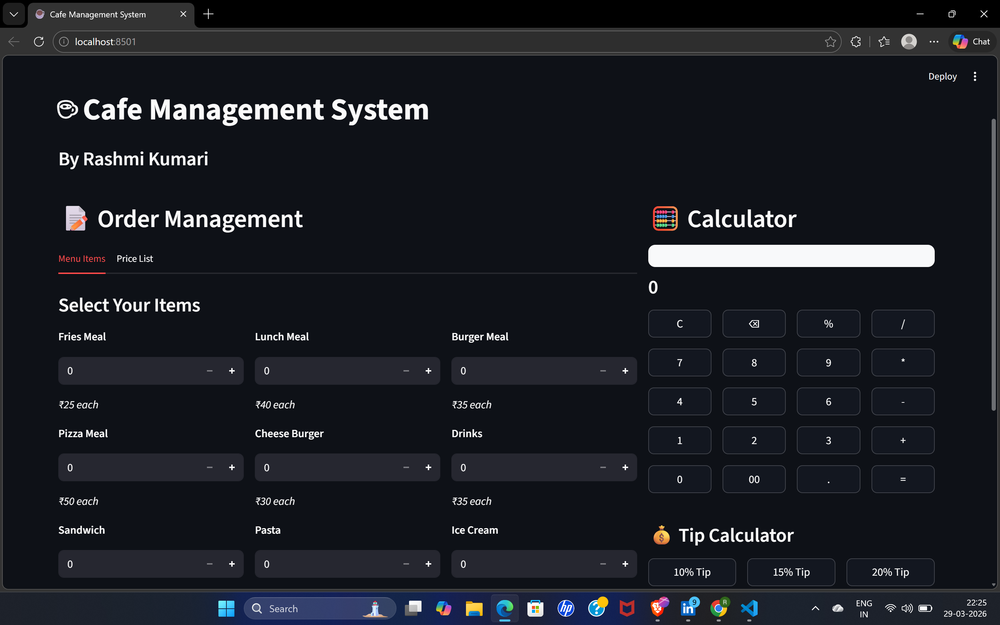

# ☕ Cafe Management System

A simple and interactive **Cafe Management System** built using **Streamlit**.
This app allows users to select menu items, generate bills, calculate totals, and even use an inbuilt calculator.

---

## 🚀 Features

* 📝 Order Management System
* 🍔 Multiple Menu Items Selection
* 💰 Automatic Bill Generation
* 📊 Cost Breakdown (Subtotal, Tax, Service Charge)
* 🧮 Built-in Calculator
* 💵 Tip Calculator (10%, 15%, 20%)
* 🔄 Reset & New Bill Option
* 🎨 Clean and Modern UI

---

## 🖥️ Tech Stack

* Python 🐍
* Streamlit 🌐

---

## 📂 Project Structure

```
project-folder/
│── cafe_management_system.py        # Main Streamlit app
│── README.md     # Project documentation
```

### 🏠 Home & Order Section



### 🧾 Bill Summary


## 💡 How It Works

1. Select items and quantity
2. Click on **Generate Bill**
3. View bill summary with:

   * Order details
   * Cost breakdown
   * Total amount
4. Use calculator for quick calculations
5. Add tip using tip calculator

---

## 📊 Pricing Logic

* Subtotal = Sum of all items
* Tax = 33%
* Service Charge = Subtotal / 99
* Total = Subtotal + Tax + Service Charge

---

## 👩‍💻 Author

**Rashmi Kumari**

---

## 📜 License

This project is for educational purposes.

---

## 🌟 Future Improvements

* Database integration
* User authentication
* Payment gateway integration
* Bill download (PDF)


